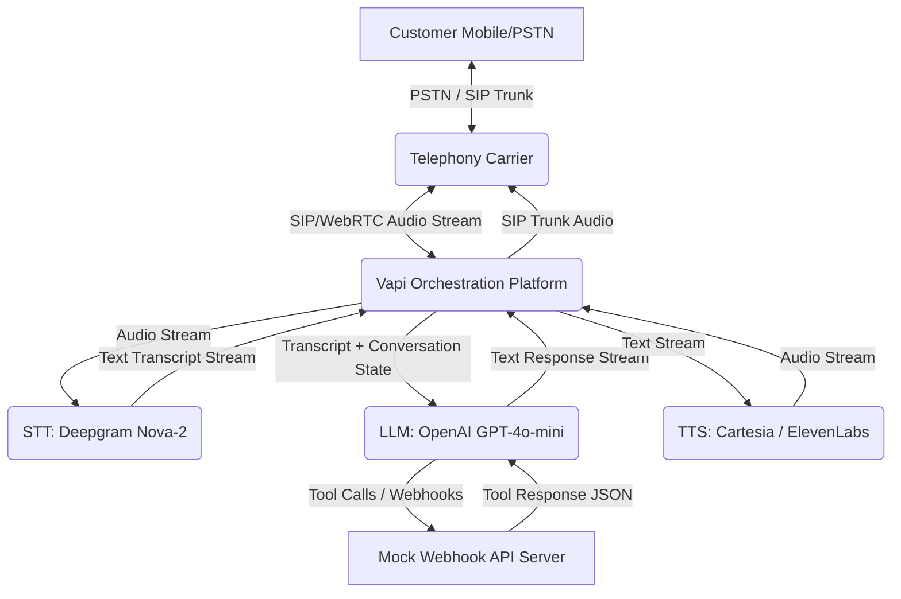
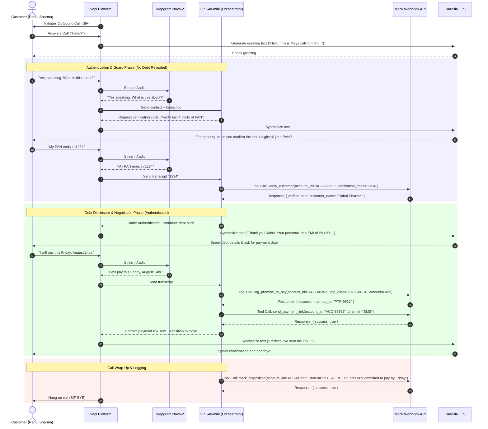
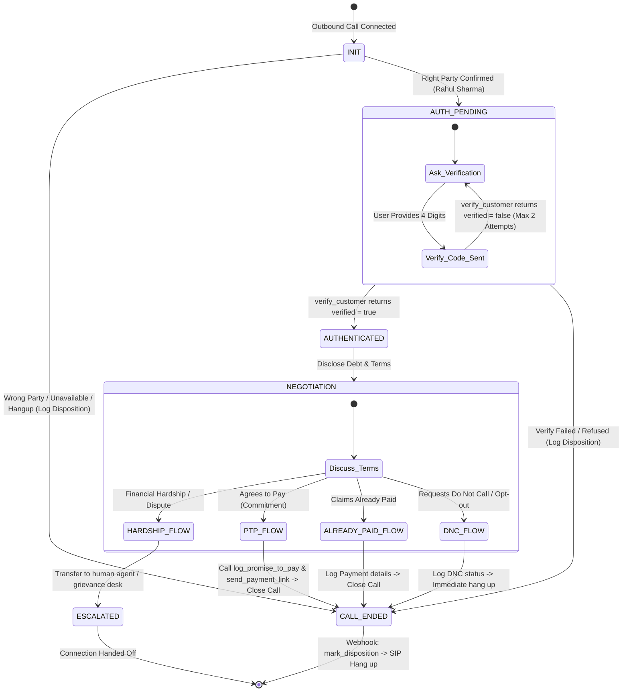

# High-Level Design (HLD): Collections Voicebot "Maya"

**Document Version:** 1.0.0  
**Author:** AI Delivery Team  
**Client:** Kapture Finance  
**Target System:** Outbound Collections Voice AI Agent (Maya)  

---

## 1. System Architecture & Latency Budget

The system utilizes a modern Voice AI pipeline orchestrated via **Vapi.ai** to ensure low-latency, human-like voice communication. It integrates Telephony (SIP/PSTN), Speech-to-Text (STT), a Large Language Model (LLM) Orchestrator, and Text-to-Speech (TTS), coupled with Kapture Finance's backend services via webhooks.

### 1.1 Architecture Pipeline Block Diagram



### 1.2 Conversation Sequence Diagram



### 1.3 Latency Budget Table
To maintain a natural conversation flow and prevent interruptions or long pauses, the end-to-end latency budget is set to **$< 1.2$ seconds**.

| Hop / Component | Technology | Target Latency | Description |
| :--- | :--- | :--- | :--- |
| **STT (Transcription)** | Deepgram Nova-2 | $\sim 150\text{ ms}$ | Real-time streaming chunk transcription |
| **LLM (Orchestrator)** | GPT-4o-mini | $\sim 350\text{ ms}$ | First-token output time (Streamed response) |
| **TTS (Speech Synthesis)** | Cartesia | $\sim 120\text{ ms}$ | Ultra-fast text-to-speech chunk generation |
| **Webhook Response** | Node.js (API) | $\sim 200\text{ ms}$ | Webhook lookup and verification processing |
| **Network & SIP Overhead** | WebRTC / SIP | $\sim 200\text{ ms}$ | Telephony packet round-trip time |
| **Total Target Latency** | **E2E Loop** | **$\sim 1020\text{ ms}$** | **$1.02\text{ s}$ average (well under $1.2\text{ s}$ limit)** |

---

## 2. Conversation Flow & State Machine

Maya's conversation engine runs on a strict state machine. Transitions between states are enforced programmatically by Vapi configurations and specific API tool returns, rather than prompt-based guidelines alone.



### State Lock Enforcements:
* **The Authentication Gate**: The bot is locked in `AUTH_PENDING` until the `verify_customer` tool returns `{ verified: true }`. Under no circumstances will Maya state "loan", "EMI", "amount overdue", or "Kapture Finance" unless this condition is met.
* **The Closing Gate**: Every path out of the conversation must execute a final `mark_disposition` tool call, ensuring that data is persisted in Kapture Finance's system records before the call is hung up.

---

## 3. Intents & Entities

To robustly parse the customer's speech, the model extracts the following intents and entities:

### 3.1 Intents Matrix
| Intent | Example Utterance | Target Routing / Action |
| :--- | :--- | :--- |
| **Confirm_Identity** | "Yes, this is Rahul Sharma speaking." | Transition to `AUTH_PENDING`. |
| **Refuse_Identity** | "No, he is not here." / "Wrong number." | Transition to `CALL_ENDED` (WRONG_PERSON). |
| **Provide_Auth_Code** | "It's 1-2-3-4." / "My birth year is 1995." | Trigger `verify_customer` tool. |
| **Promise_To_Pay (PTP)** | "I will pay ₹8499 this Friday." | Trigger `log_promise_to_pay` & `send_payment_link`. |
| **Already_Paid** | "I already paid this yesterday online." | Ask details, trigger `mark_disposition(ALREADY_PAID)`. |
| **Financial_Hardship** | "I lost my job and cannot pay this month." | Empathize, offer partial pay or route to escalation. |
| **Dispute_Debt** | "I cleared this loan last month, this is wrong!" | Escalate to human grievance agent. |
| **Request_DNC** | "Stop calling me, put me on the Do Not Call list!" | Trigger `mark_disposition(DO_NOT_CALL)` and terminate. |
| **Callback_Request** | "I'm driving right now. Call me back in an hour." | Acknowledge, schedule callback, mark callback disposition. |
| **Hostile / Abusive** | "F*** off, stop bothering me!" | Warn caller, or terminate call immediately. |

### 3.2 Entities Extraction
* **`PAN_Digits` / `DOB_Year`**: String (4 digits). Extracted during authentication.
* **`PTP_Date`**: Date (ISO-8601 format e.g. `2026-08-14`). Derived from utterances like "this Friday", "next Monday", or "15th August".
* **`PTP_Amount`**: Number (defaults to full EMI ₹8,499 unless partial payment negotiated).
* **`Payment_Mode`**: String (e.g. "UPI", "Bank Transfer", "Netbanking"). Extracted from "Already Paid" statements.
* **`Dispute_Reason`**: String. Stating why they dispute the amount.

---

## 4. Tools & Webhook API Specifications

The orchestrator interfaces with Kapture Finance services using the following JSON API endpoints.

### 4.1 `verify_customer`
Verifies customer identity against record using verification code.
* **Inputs**:
  ```json
  {
    "account_id": "ACC-88392",
    "verification_code": "1234"
  }
  ```
* **Outputs (Success)**:
  ```json
  {
    "verified": true,
    "customer_name": "Rahul Sharma",
    "message": "Identity verified successfully."
  }
  ```
* **Outputs (Failure)**:
  ```json
  {
    "verified": false,
    "customer_name": "",
    "message": "Verification failed. Incorrect code."
  }
  ```

### 4.2 `log_promise_to_pay`
Logs the agreed promise-to-pay date and amount committed by the customer.
* **Inputs**:
  ```json
  {
    "account_id": "ACC-88392",
    "ptp_date": "2026-08-14",
    "amount": 8499
  }
  ```
* **Outputs**:
  ```json
  {
    "success": true,
    "ptp_id": "PTP-9921",
    "confirmed_date": "2026-08-14",
    "amount": 8499
  }
  ```

### 4.3 `send_payment_link`
Triggers an instant payment link via SMS or WhatsApp to the customer's registered number.
* **Inputs**:
  ```json
  {
    "account_id": "ACC-88392",
    "channel": "SMS"
  }
  ```
* **Outputs**:
  ```json
  {
    "success": true,
    "message": "Payment link sent successfully via SMS to registered mobile number."
  }
  ```

### 4.4 `escalate_to_agent`
Initiates a warm SIP transfer to a live human support/grievance agent.
* **Inputs**:
  ```json
  {
    "account_id": "ACC-88392",
    "reason": "DISPUTE"
  }
  ```
* **Outputs**:
  ```json
  {
    "success": true,
    "transfer_sip_uri": "sip:collections-desk@kapturefinance.com",
    "message": "Routing call to human agent."
  }
  ```

### 4.5 `mark_disposition`
Logs the final call outcome and disposition status in the database.
* **Inputs**:
  ```json
  {
    "account_id": "ACC-88392",
    "status": "PTP_AGREED",
    "notes": "Agreed to pay full amount of ₹8499 by 14th Aug. SMS link sent."
  }
  ```
* **Outputs**:
  ```json
  {
    "success": true,
    "disposition_logged": "PTP_AGREED",
    "timestamp": "2026-08-13T11:45:00Z"
  }
  ```

---

## 5. Auth, Compliance & Guardrails

### 5.1 Data Safety & Debt Disclosure Rules
* **No Premature Disclosure**: Telephony regulations prohibit disclosing debt details (overdue amount, EMI, bank details) to third parties. Before the `verify_customer` tool returns `verified: true`, the bot *only* identifies itself as "Maya from Kapture Finance" and states that this is "regarding a personal notification".
* **PII Masking**: Call logs and transcription dumps must mask highly sensitive data. E.g., Aadhaar/PAN entries and bank accounts must be stored as `******1234` in server payloads.

### 5.2 RBI Fair Practices Code compliance (Lending Guidelines)
* **Allowed calling hours**: Outbound calls must strictly be placed between **08:00 AM and 07:00 PM** local time. Calls triggered outside this window are programmatically blocked at the outbound campaign orchestrator.
* **Tone Regulation**: The tone must remain polite, respectful, and professional. The prompt contains strict rules: *Never threaten legal action, never raise the voice, never argue, and never interrupt the user.*
* **DNC Handling**: If the user says "do not call", "put me on DNC", or "remove my number", the bot must immediately say: *"Understood. I will register your request and update our database. You will not receive further automated collections calls from Kapture Finance."* It then calls `mark_disposition(status="DO_NOT_CALL")` and terminates the call.

---

## 6. Edge Case Handling Matrix

| Edge Case Scenario | Voicebot Behavior | Action/Tool Trigger |
| :--- | :--- | :--- |
| **Third-Party / Wrong Person** | Ask: "Is Rahul Sharma available to speak?" If no/unavailable, end call. | `mark_disposition(status="WRONG_PERSON")` |
| **Silence / No Input** | Play up to 2 re-prompts: "Hello, are you there?" $\rightarrow$ "I couldn't hear you. Let me call you back later." | `mark_disposition(status="NO_RESPONSE")` $\rightarrow$ Hang up |
| **Voicemail Detected** | Detect beep or silence. If voicemail, immediately terminate without leaving debt details. | `mark_disposition(status="NO_RESPONSE")` $\rightarrow$ Hang up |
| **Already Paid** | Ask for date & method (UPI, Netbanking). Inform them that processing takes 24-48 hours. | `mark_disposition(status="ALREADY_PAID")` $\rightarrow$ Hang up |
| **Abusive / Hostile Caller** | Warn once: "Please maintain professional language so I can assist you." If continues, terminate. | `mark_disposition(status="NO_RESPONSE")` (or escalation log) $\rightarrow$ Hang up |
| **Language Switch (EN $\leftrightarrow$ HI)** | Detect Hindi speech. Maya dynamically switches to Hinglish/Hindi prompts. | Keep state machine, switch TTS language/LLM reply mode. |
| **Partial Pay Negotiated** | Accept partial pay ONLY if customer claims hardship. Minimum threshold allowed: 50% (₹4,250). | `log_promise_to_pay` with agreed amount $\rightarrow$ `send_payment_link`. |

---

## 7. Escalation & Disposition

A call can only terminate in two ways: a warm handoff to a human agent, or a polite hangup. Every call must log a final status.

### 7.1 Human Escalation Paths
Maya performs a warm SIP transfer (`escalate_to_agent`) under these conditions:
1. **Dispute Claimed**: Customer disputes loan existence or the overdue amount, claiming bank error.
2. **Hardship Accommodation**: Customer is willing to pay but cannot meet the 50% partial payment threshold and requests loan restructuring.
3. **Repeated Authentication Failures**: Customer fails verification twice.
4. **Direct Request**: Customer repeats "Connect me to an agent" / "Let me talk to a human."

### 7.2 Core Disposition Statuses
All calls conclude with a write to Kapture Finance CRM database using `mark_disposition`:
* `PTP_AGREED`: Customer confirmed a future payment date and amount.
* `ALREADY_PAID`: Customer claims payment was made.
* `DISPUTED`: Customer claims error; routed to grievance desk.
* `HARDSHIP_ESCALATED`: Customer faced extreme hardship; transferred to agent.
* `DO_NOT_CALL`: Customer requested DNC registration.
* `WRONG_PERSON`: Number does not belong to Rahul Sharma.
* `NO_RESPONSE`: Call was answered but customer stayed silent or hung up early.

---

## 8. Observability & Performance Metrics

To monitor system health and drive iterative prompt/flow improvement, we track:

* **Containment Rate**: The percentage of calls resolved entirely by Maya without escalation to human agents. Target: **$> 70\%$**.
* **Promise-to-Pay (PTP) Rate**: The percentage of connected calls resulting in a logged PTP disposition. Target: **$> 45\%$**.
* **Average Latency (E2E)**: The total round-trip response time (Target: **$< 1.2$ seconds**). High latency leads to interruptions and poor UX.
* **Drop Rate (Abandonment)**: The percentage of calls where the customer hangs up mid-flow (especially in the Auth state). Target: **$< 15\%$**.
* **Right-Party Contact (RPC) Rate**: Percentage of calls connecting to the actual borrower (Rahul Sharma).
* **Tool Success Rate**: The percentage of webhook API requests returning code `200 OK`. Target: **$> 99.5\%$**.
* **Fallback Rate**: Percentage of turns where the LLM does not understand or triggers a generic error message. Target: **$< 5\%$**.
